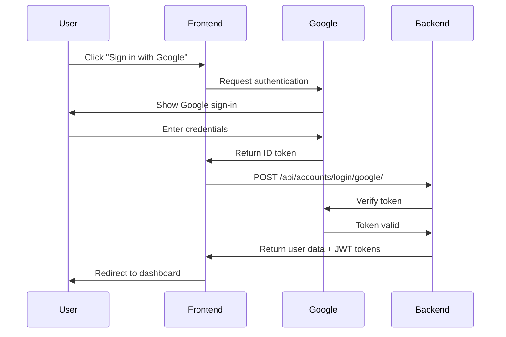

# Google OAuth Integration Documentation for MedixMall

## 🎯 Overview

This document provides complete integration guidelines for implementing Google OAuth authentication in the MedixMall ecommerce platform. It includes endpoint specifications, payload examples, response formats, and frontend integration instructions.

## 📋 Table of Contents

1. [Configuration Requirements](#configuration-requirements)
2. [API Endpoint Specification](#api-endpoint-specification)
3. [Authentication Flow](#authentication-flow)
4. [Frontend Integration Guide](#frontend-integration-guide)
5. [Testing Guide](#testing-guide)
6. [Error Handling](#error-handling)
7. [Security Considerations](#security-considerations)

## 🔧 Configuration Requirements

### Google OAuth Client Setup

1. **Client ID**: `503326319438-eejn7gtbgl0ko2lgdn5cf6lqfpgpnl2p.apps.googleusercontent.com`
2. **Client Secret**: Available in server environment
3. **Authorized Origins**: 
   - `https://backend.okpuja.in` (Production)
   - `http://localhost:3000` (Development)
   - `http://127.0.0.1:3000` (Development)

### Environment Variables

```bash
SOCIAL_AUTH_GOOGLE_OAUTH2_KEY=503326319438-eejn7gtbgl0ko2lgdn5cf6lqfpgpnl2p.apps.googleusercontent.com
SOCIAL_AUTH_GOOGLE_OAUTH2_SECRET=your_client_secret_here
```

## 🚀 API Endpoint Specification

### Endpoint Details

- **URL**: `/api/accounts/login/google/`
- **Method**: `POST`
- **Content-Type**: `application/json`
- **Authentication**: Not required (public endpoint)

### Request Payload

```json
{
  "id_token": "google_id_token_here",
  "role": "user"
}
```

#### Parameters

| Parameter | Type | Required | Description | Valid Values |
|-----------|------|----------|-------------|--------------|
| `id_token` | string | Yes | Google ID token from frontend | JWT string |
| `role` | string | No | User role (defaults to 'user') | `"user"`, `"supplier"` |

### Response Formats

#### Success Response (200)

```json
{
  "user": {
    "id": 123,
    "email": "user@gmail.com",
    "full_name": "John Doe",
    "contact": null,
    "role": "user",
    "email_verified": true,
    "is_on_duty": false,
    "address_line_1": "",
    "address_line_2": "",
    "city": "",
    "state": "",
    "postal_code": "",
    "country": "",
    "medixmall_mode": false
  },
  "access": "eyJ0eXAiOiJKV1QiLCJhbGciOiJIUzI1NiJ9...",
  "refresh": "eyJ0eXAiOiJKV1QiLCJhbGciOiJIUzI1NiJ9...",
  "is_new_user": false,
  "message": "Welcome back!"
}
```

#### Error Responses

##### Invalid Token (400)

```json
{
  "error": "Invalid Google token",
  "details": "Token verification failed"
}
```

##### Missing Token (400)

```json
{
  "error": "Google ID token is required"
}
```

##### Invalid Role (400)

```json
{
  "error": "Invalid role. Only \"user\" and \"supplier\" are allowed."
}
```

##### Configuration Error (500)

```json
{
  "error": "Google OAuth not configured properly"
}
```

## 🔄 Authentication Flow

### 1. Frontend Flow



### 2. Backend Processing

1. **Token Verification**: Verify Google ID token with Google servers
2. **User Lookup**: Check if user exists by email
3. **User Creation/Update**: Create new user or update existing user info
4. **Cart Synchronization**: Sync guest cart with user account
5. **JWT Generation**: Generate access and refresh tokens
6. **Welcome Email**: Send welcome email for new users

## 💻 Frontend Integration Guide

### HTML Implementation

```html
<!DOCTYPE html>
<html>
<head>
    <script src="https://accounts.google.com/gsi/client" async defer></script>
</head>
<body>
    <div id="g_id_onload"
         data-client_id="503326319438-eejn7gtbgl0ko2lgdn5cf6lqfpgpnl2p.apps.googleusercontent.com"
         data-callback="handleCredentialResponse"
         data-auto_prompt="false">
    </div>
    
    <div class="g_id_signin" 
         data-type="standard"
         data-size="large"
         data-theme="outline"
         data-text="sign_in_with"
         data-shape="rectangular"
         data-logo_alignment="left">
    </div>
    
    <script>
        function handleCredentialResponse(response) {
            // Send token to backend
            loginWithGoogle(response.credential);
        }
        
        async function loginWithGoogle(idToken) {
            try {
                const response = await fetch('https://backend.okpuja.in/api/accounts/login/google/', {
                    method: 'POST',
                    headers: {
                        'Content-Type': 'application/json',
                    },
                    body: JSON.stringify({
                        id_token: idToken,
                        role: 'user'
                    })
                });
                
                const data = await response.json();
                
                if (response.ok) {
                    // Store tokens
                    localStorage.setItem('access_token', data.access);
                    localStorage.setItem('refresh_token', data.refresh);
                    
                    // Handle successful login
                    window.location.href = '/dashboard';
                } else {
                    // Handle error
                    console.error('Login failed:', data.error);
                    alert('Login failed: ' + data.error);
                }
            } catch (error) {
                console.error('Network error:', error);
                alert('Login failed due to network error');
            }
        }
    </script>
</body>
</html>
```

### React Implementation

```jsx
import React from 'react';

const GoogleLoginButton = () => {
    const handleCredentialResponse = async (response) => {
        try {
            const result = await fetch('https://backend.okpuja.in/api/accounts/login/google/', {
                method: 'POST',
                headers: {
                    'Content-Type': 'application/json',
                },
                body: JSON.stringify({
                    id_token: response.credential,
                    role: 'user'
                })
            });
            
            const data = await result.json();
            
            if (result.ok) {
                // Store tokens
                localStorage.setItem('access_token', data.access);
                localStorage.setItem('refresh_token', data.refresh);
                
                // Update app state or redirect
                window.location.href = '/dashboard';
            } else {
                throw new Error(data.error);
            }
        } catch (error) {
            console.error('Login error:', error);
            alert('Login failed: ' + error.message);
        }
    };
    
    React.useEffect(() => {
        // Load Google script
        const script = document.createElement('script');
        script.src = 'https://accounts.google.com/gsi/client';
        script.async = true;
        script.defer = true;
        document.body.appendChild(script);
        
        script.onload = () => {
            window.google.accounts.id.initialize({
                client_id: '503326319438-eejn7gtbgl0ko2lgdn5cf6lqfpgpnl2p.apps.googleusercontent.com',
                callback: handleCredentialResponse
            });
            
            window.google.accounts.id.renderButton(
                document.getElementById('google-signin-button'),
                { theme: 'outline', size: 'large' }
            );
        };
        
        return () => {
            document.body.removeChild(script);
        };
    }, []);
    
    return <div id="google-signin-button"></div>;
};

export default GoogleLoginButton;
```

### Vue.js Implementation

```vue
<template>
  <div>
    <div id="google-signin-button"></div>
  </div>
</template>

<script>
export default {
  name: 'GoogleLogin',
  mounted() {
    this.loadGoogleScript();
  },
  methods: {
    loadGoogleScript() {
      const script = document.createElement('script');
      script.src = 'https://accounts.google.com/gsi/client';
      script.async = true;
      script.defer = true;
      document.body.appendChild(script);
      
      script.onload = () => {
        window.google.accounts.id.initialize({
          client_id: '503326319438-eejn7gtbgl0ko2lgdn5cf6lqfpgpnl2p.apps.googleusercontent.com',
          callback: this.handleCredentialResponse
        });
        
        window.google.accounts.id.renderButton(
          document.getElementById('google-signin-button'),
          { theme: 'outline', size: 'large' }
        );
      };
    },
    
    async handleCredentialResponse(response) {
      try {
        const result = await fetch('https://backend.okpuja.in/api/accounts/login/google/', {
          method: 'POST',
          headers: {
            'Content-Type': 'application/json',
          },
          body: JSON.stringify({
            id_token: response.credential,
            role: 'user'
          })
        });
        
        const data = await result.json();
        
        if (result.ok) {
          // Store tokens
          localStorage.setItem('access_token', data.access);
          localStorage.setItem('refresh_token', data.refresh);
          
          // Redirect or update state
          this.$router.push('/dashboard');
        } else {
          throw new Error(data.error);
        }
      } catch (error) {
        console.error('Login error:', error);
        alert('Login failed: ' + error.message);
      }
    }
  }
};
</script>
```

## 🧪 Testing Guide

### Manual Testing

1. **Generate Test Token**: Use the provided HTML token generator
2. **Test with cURL**:

```bash
curl -X POST 'https://backend.okpuja.in/api/accounts/login/google/' \
  -H 'accept: application/json' \
  -H 'Content-Type: application/json' \
  -d '{
    "id_token": "YOUR_GENERATED_TOKEN_HERE",
    "role": "user"
  }'
```

### Automated Testing

```python
import requests

def test_google_oauth():
    url = "https://backend.okpuja.in/api/accounts/login/google/"
    
    # Test with valid token
    data = {
        "id_token": "valid_google_token",
        "role": "user"
    }
    
    response = requests.post(url, json=data)
    
    if response.status_code == 200:
        print("✅ Login successful")
        print(f"User: {response.json()['user']['email']}")
    else:
        print(f"❌ Login failed: {response.json()['error']}")

# Run test
test_google_oauth()
```

### Swagger/OpenAPI Testing

Access the Swagger UI at: `https://backend.okpuja.in/swagger/`

1. Navigate to "Authentication - Social" section
2. Find "Google Social Login" endpoint
3. Click "Try it out"
4. Enter your Google ID token
5. Select role (user/supplier)
6. Click "Execute"

## ⚠️ Error Handling

### Common Issues and Solutions

| Error | Cause | Solution |
|-------|-------|----------|
| `Google OAuth not configured properly` | Environment variable not set | Set `SOCIAL_AUTH_GOOGLE_OAUTH2_KEY` |
| `Token has wrong audience` | Wrong client ID in token | Generate token with correct client ID |
| `Invalid Google token` | Token expired/malformed | Generate new token |
| `redirect_uri_mismatch` | Domain not in authorized origins | Add domain to Google Console |

### Error Response Handling

```javascript
async function handleGoogleLogin(idToken) {
    try {
        const response = await fetch('/api/accounts/login/google/', {
            method: 'POST',
            headers: { 'Content-Type': 'application/json' },
            body: JSON.stringify({ id_token: idToken, role: 'user' })
        });
        
        const data = await response.json();
        
        switch (response.status) {
            case 200:
                // Success - redirect to dashboard
                return { success: true, data };
            case 400:
                // Client error - show user-friendly message
                return { success: false, error: data.error, userMessage: 'Please try signing in again.' };
            case 500:
                // Server error - show generic message
                return { success: false, error: data.error, userMessage: 'Server error. Please try again later.' };
            default:
                return { success: false, error: 'Unknown error', userMessage: 'Something went wrong.' };
        }
    } catch (error) {
        return { success: false, error: error.message, userMessage: 'Network error. Please check your connection.' };
    }
}
```

## 🔒 Security Considerations

### Token Security

1. **Token Validation**: All tokens are verified with Google servers
2. **Expiration**: Tokens have built-in expiration (typically 1 hour)
3. **Audience Verification**: Tokens must match configured client ID
4. **HTTPS Only**: All communications over HTTPS in production

### Best Practices

1. **Never store ID tokens** - they're single-use for authentication
2. **Store JWT tokens securely** - use httpOnly cookies or secure storage
3. **Implement token refresh** - use refresh tokens to get new access tokens
4. **Validate user roles** - ensure users have appropriate permissions
5. **Monitor failed attempts** - log and monitor authentication failures

### CORS Configuration

Ensure your frontend domain is properly configured:

```python
# Django settings.py
CORS_ALLOWED_ORIGINS = [
    "https://yourdomain.com",
    "http://localhost:3000",
    "http://127.0.0.1:3000",
]
```

## 📊 API Response Examples

### New User Registration

```json
{
  "user": {
    "id": 124,
    "email": "newuser@gmail.com",
    "full_name": "New User",
    "contact": null,
    "role": "user",
    "email_verified": true,
    "is_on_duty": false,
    "medixmall_mode": false
  },
  "access": "eyJ0eXAiOiJKV1QiLCJhbGciOiJIUzI1NiJ9...",
  "refresh": "eyJ0eXAiOiJKV1QiLCJhbGciOiJIUzI1NiJ9...",
  "is_new_user": true,
  "message": "Welcome to MedixMall!"
}
```

### Existing User Login

```json
{
  "user": {
    "id": 123,
    "email": "existinguser@gmail.com",
    "full_name": "Existing User",
    "contact": "+1234567890",
    "role": "user",
    "email_verified": true,
    "is_on_duty": false,
    "medixmall_mode": true
  },
  "access": "eyJ0eXAiOiJKV1QiLCJhbGciOiJIUzI1NiJ9...",
  "refresh": "eyJ0eXAiOiJKV1QiLCJhbGciOiJIUzI1NiJ9...",
  "is_new_user": false,
  "message": "Welcome back!"
}
```

### Supplier Registration

```json
{
  "user": {
    "id": 125,
    "email": "supplier@gmail.com",
    "full_name": "Supplier Name",
    "contact": null,
    "role": "supplier",
    "email_verified": true,
    "is_on_duty": false,
    "medixmall_mode": false
  },
  "access": "eyJ0eXAiOiJKV1QiLCJhbGciOiJIUzI1NiJ9...",
  "refresh": "eyJ0eXAiOiJKV1QiLCJhbGciOiJIUzI1NiJ9...",
  "is_new_user": true,
  "message": "Welcome to MedixMall!"
}
```

## 📚 Additional Resources

- [Google OAuth 2.0 Documentation](https://developers.google.com/identity/protocols/oauth2)
- [Google Sign-In JavaScript Library](https://developers.google.com/identity/gsi/web)
- [JWT Token Debugger](https://jwt.io/)
- [MedixMall API Documentation](https://backend.okpuja.in/swagger/)

## 🔗 Related Endpoints

- **Token Refresh**: `POST /api/accounts/token/refresh/`
- **User Profile**: `GET /api/accounts/me/`
- **Logout**: `POST /api/accounts/logout/`
- **Password Change**: `POST /api/accounts/password/change/`

---

**Last Updated**: October 2025  
**API Version**: v1  
**Backend URL**: https://backend.okpuja.in